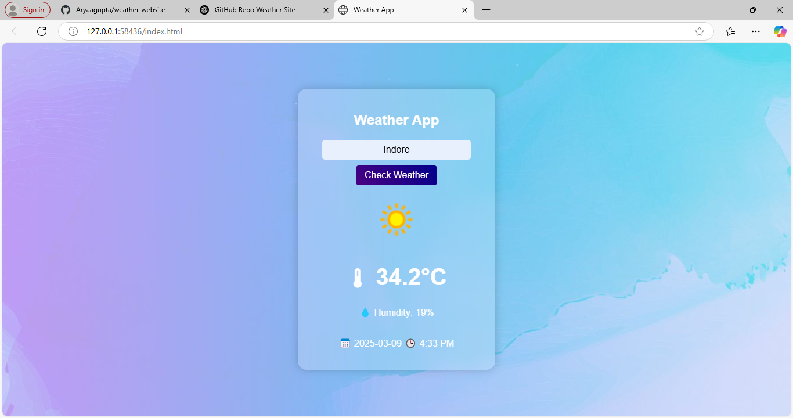

# 🌦️ Weather Website

## 📖 About the Project  
This is a simple **weather website** that allows users to check real-time weather conditions for any location. It fetches data using an API and displays information such as temperature, humidity, and weather conditions.

## 🛠️ Technologies Used  
- **HTML** – Structure of the website  
- **CSS** – Styling and layout  
- **JavaScript** – Fetching and displaying weather data  
- **Weather API** – Provides real-time weather information  

## 📷 Preview  
  

## 🔧 Features  
✅ Search for any city  
✅ Displays temperature, humidity, and weather conditions  
✅ User-friendly interface  
✅ Responsive design  

## 📂 How to Run Locally  
1. Clone the repository:  
   ```sh
   git clone https://github.com/Aryaagupta/weather-website.git
